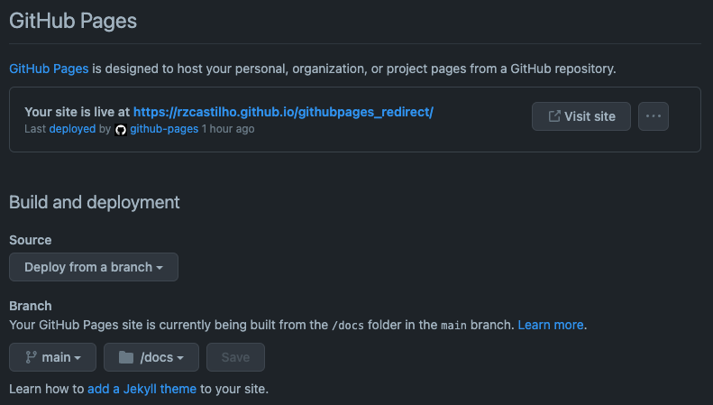

# Criando um `REDIRECT` no Github Pages

## Procedimento

1. Adicione um arquivo `index.hml` ao repositório com o conteúdo abaixo, lembrando de substituir a URL para onde você quer redirecionar seu domínio do Github Pages, no exemplo abaixo o site será redirecionado para o link <https://documenter.getpostman.com/view/7294517/SzmfZHnd>.

```html
<!DOCTYPE html>
<meta charset="utf-8">
<title>Redirecting to KeycloakRestAPI</title>
<meta http-equiv="refresh" content="0; URL=https://documenter.getpostman.com/view/7294517/SzmfZHnd">
<link rel="canonical" href="https://documenter.getpostman.com/view/7294517/SzmfZHnd">
```

2. Configure a `branch` à ser utilizada pelo Github Pages no processo de build, e caso o `index.html` não esteja na raíz do repositório, também selecionar a diretório onde ele se encontra. No caso desse repositório ele está configurado para a branch `main` na pasta `docs`.



3. Após a configuração será disparado o build no Github Actions e gerada a URL do Github Pages no formato `https://<usuário>.github.io/<repositório>/`, no caso desse repositório a URL é <https://rzcastilho.github.io/githubpages_redirect/>, que ao clicar o usuário será redirecionado para a URL configurada no `index.html`.

## Referências

* <https://dev.to/steveblue/setup-a-redirect-on-github-pages-1ok7>
